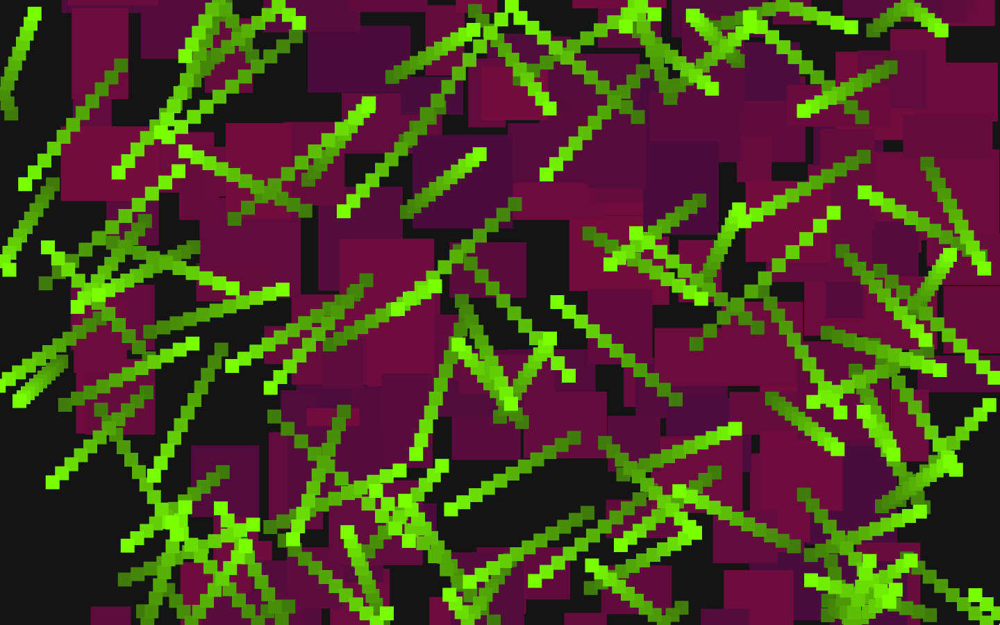
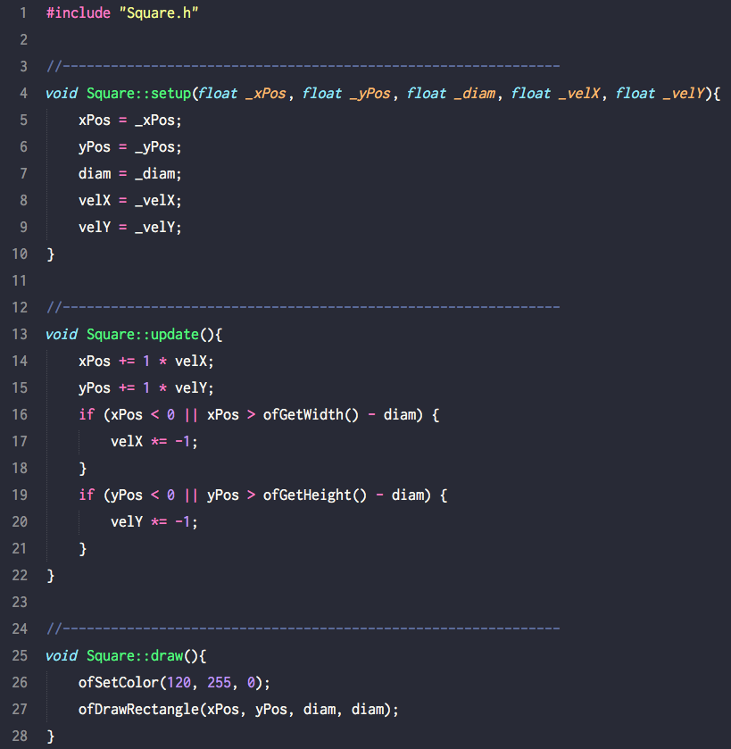
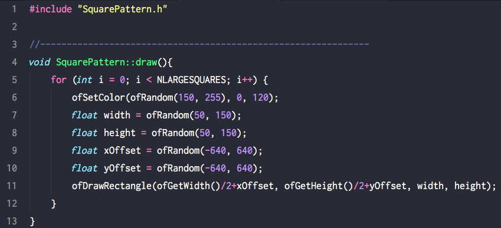

# Week 2

### What's going on?

In this sketch there's a `Sqaure` class and a `SquarePattern` class. The `Square` class gets instantiated with an array of 100 squares, and has `setup`, `update`, and `draw` functions. Here's a look at it:

The `SquarePattern` class is much simpler: it just has a `draw` function. Here it is:

