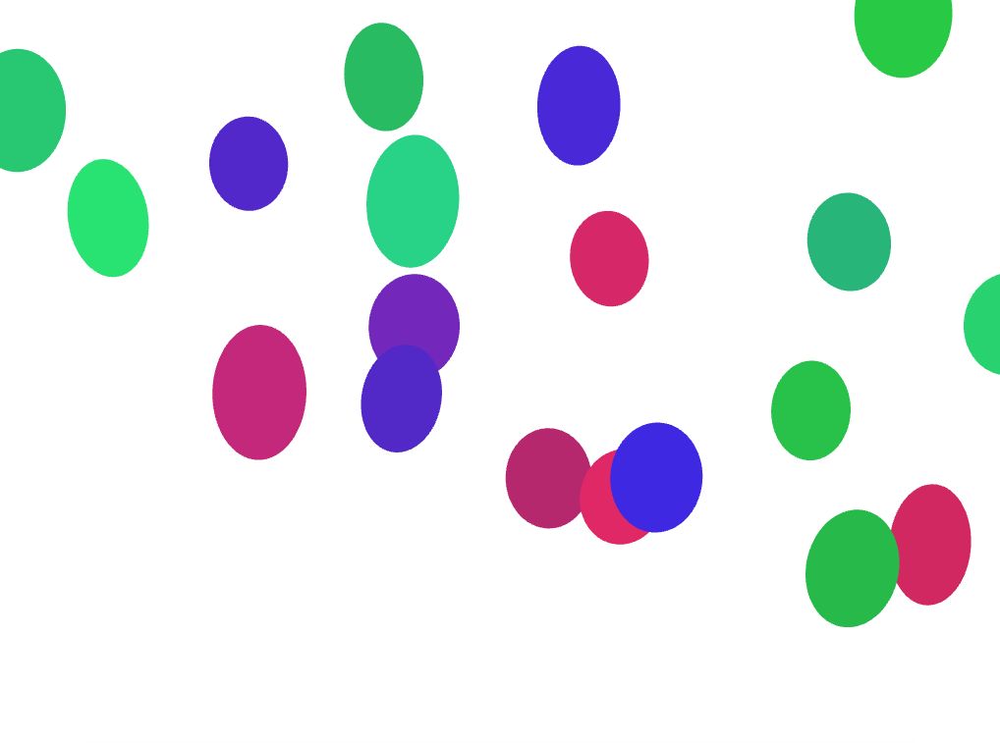

# Week 3, Portrait

### What's going on?

The "balloons" are generated off screen and float up through the window. They have random noise applied to their x and y movements, as well as to their angle of rotation.
