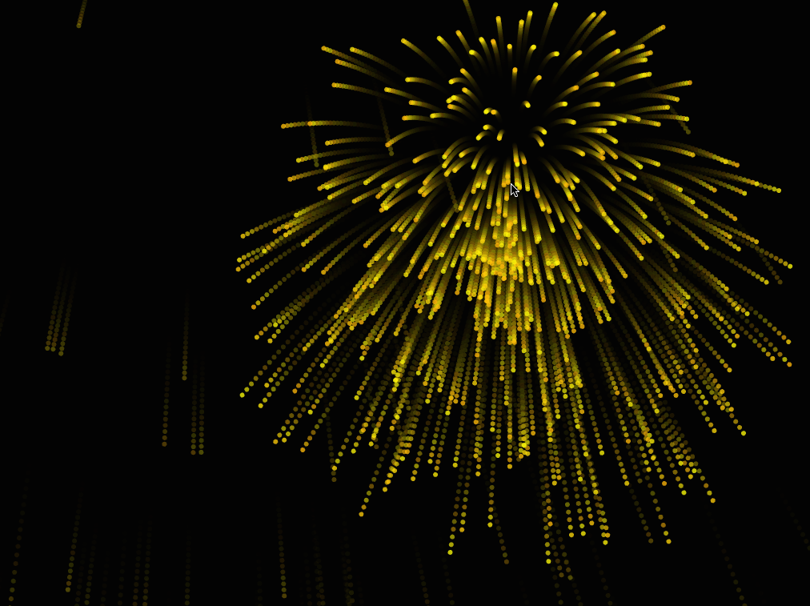

# Week 6, Fireworks

### What's going on?

The fireworks are particle systems full of particles. They generate at the location you click by picking a random point on a circle around that point and using a random number to scale that value a tiny bit.
